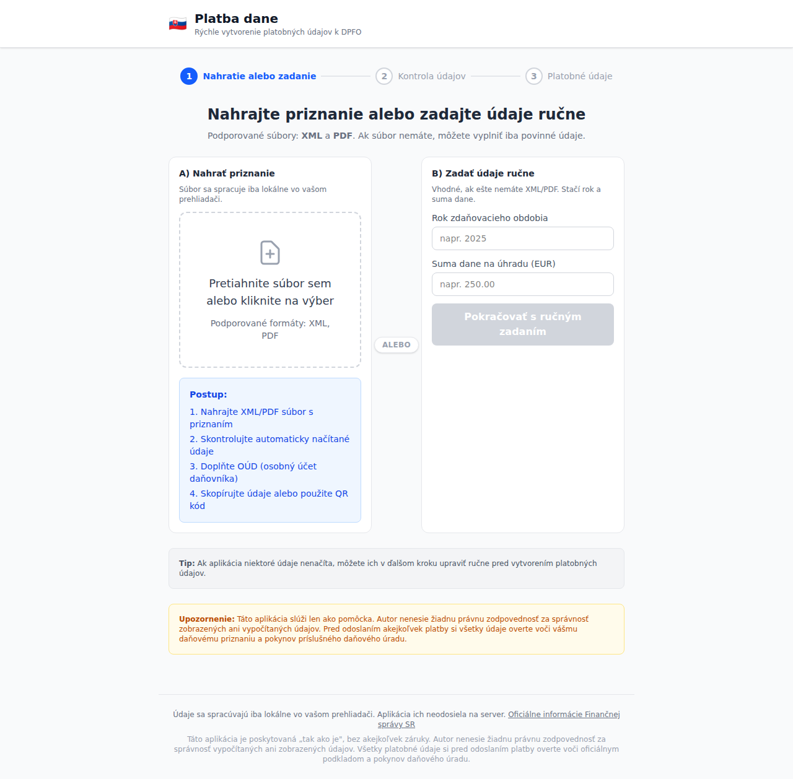
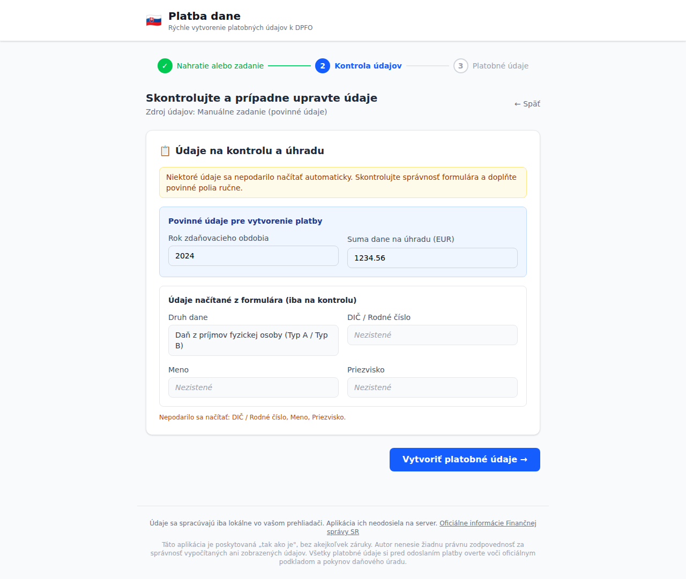
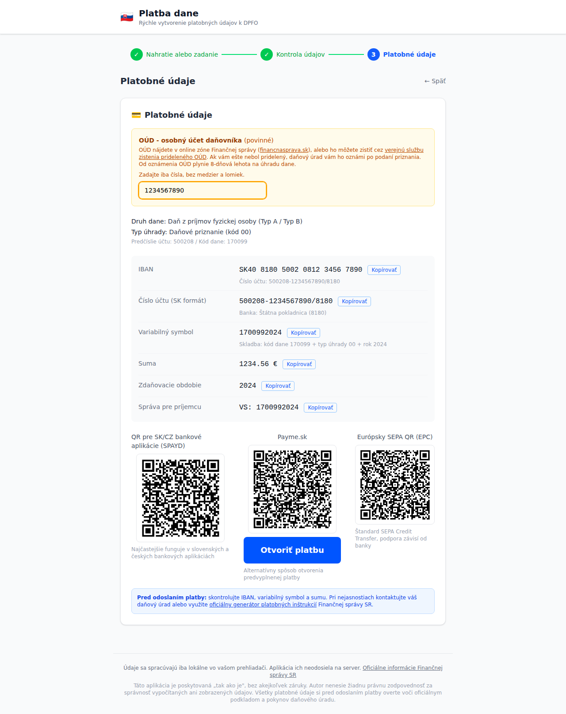

# 🇸🇰 Platba dane

Jednoduchá webová aplikácia na rýchle vytvorenie platobných údajov pre **daň z príjmov fyzickej osoby (DPFO)** na Slovensku.

🔗 **[platba-dane.arcicode.com](https://platba-dane.arcicode.com)**

## Čo to robí

Aplikácia v troch krokoch vygeneruje všetky potrebné platobné údaje (IBAN, variabilný symbol, sumu) a QR kódy pre platbu dane:

1. **Nahratie alebo zadanie** – nahrajte XML alebo PDF súbor s daňovým priznaním, alebo zadajte rok a sumu ručne
2. **Kontrola údajov** – skontrolujte a prípadne upravte automaticky načítané údaje
3. **Platobné údaje** – zadajte OÚD a získajte IBAN, variabilný symbol a QR kódy pre SK/CZ bankové aplikácie (SPAYD), Payme.sk aj európsky SEPA štandard (EPC)

**Všetky dáta sa spracúvajú iba lokálne vo vašom prehliadači** – žiadny súbor ani osobný údaj sa neodosiela na server.

## Screenshoty

### Krok 1 – Nahratie súboru alebo ručné zadanie



### Krok 2 – Kontrola načítaných údajov



### Krok 3 – Platobné údaje a QR kódy



## Lokálny vývoj

```bash
npm install
npm run dev
```

## Zostavenie

```bash
npm run build
```

## Upozornenie

Táto aplikácia slúži len ako pomôcka. Autor nenesie žiadnu právnu zodpovednosť za správnosť zobrazených ani vypočítaných údajov. Pred odoslaním akejkoľvek platby si všetky údaje overte voči vášmu daňovému priznaniu a pokynov príslušného daňového úradu.
